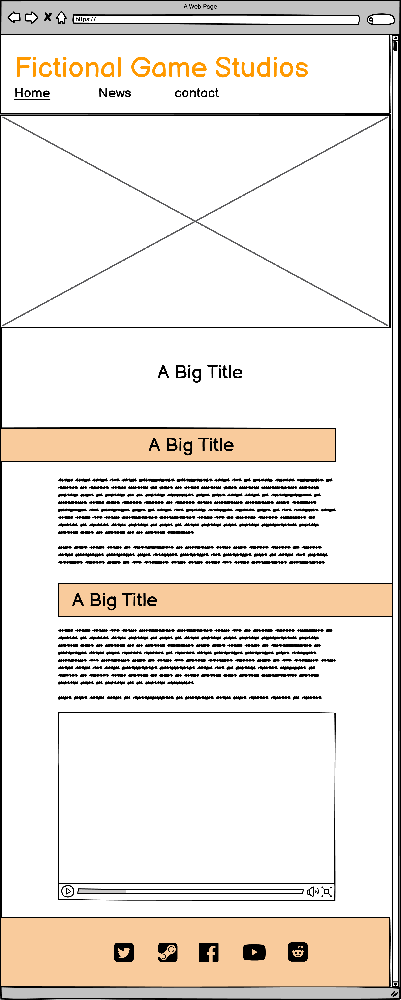

***

## planning phase
* Purpose of the Project

   the purpose of the this project is to make a game developer website.
   this webpage is for a Fictional game developer to announce their games using the news feed and tell about them self
   it will also give the contact information about inquiries and available spot for future employees.

* User Stories

   As a game enthusiast, I want check on upcoming game so that the I know when to expect sthe game to be released and what to expect of the game.

   As a unemployed, I want find an available spot so that I can apply for work.

   As a journalist, I want to contact someone so that I can book for an interview.

* Features

   * Navigation bar
   * footer
   * news feeds with video
   * Subscribe to news
   * contact form on contact page

* Future Features

    * interactive news feed
    * Slideshow gallery

* Typography and Color Scheme

   This webpage is going to use "Roboto" for headers and "Lato" for paragraphs and smaller text, this is due to it's readability and it's also hosted on Googlefonts

   It is also going to some AwesomeFont for some visual and intuitive symbols

   the color scheme is gonna be neutral gray-scale with hints of orange to highlight 

* Wireframes

   ### Dekstop sized wireframes

   
   
   

   ### Handheld sized wireframes

   
   
   
***

## Deployement phase

* Technology
* testing
   * code validation
   * test cases (user story based with screenshots)
   * fixed bugs

      During deployment all external links worked, but all media and images did not.
      This was due to making the incorrect links such as **"/static/*"**.
      To resolve this issue I made sure to put correct pathways to resources.

   * supported screens and browsers

* Deployment
   * via gitpod
   * via github pages
* credits
### Issues

 ### Screenshots from deployed page

width 1080

width 720

 

***

## Further maintainability

Template to add a new block to the news page

Add this to append to the "news.html" under section with the id "news-container"

      <article class="news-update">
            
            

                <h3></h3>
                

                

            

        </article>
 

