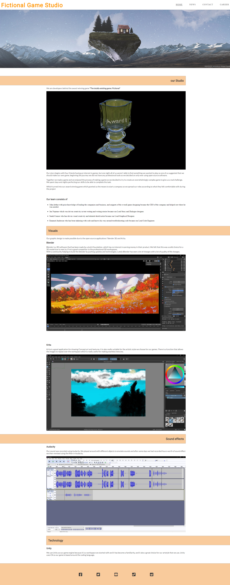
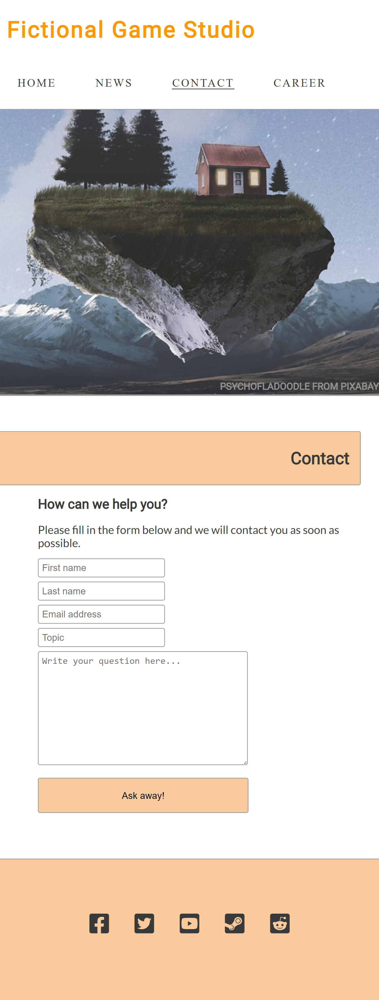

Casper Hille

Full-Stack Development course (5p)
***

## planning phase
* Purpose of the Project

   the purpose of the this project is to make a game developer website.
   this webpage is for a Fictional game developer to announce their games using the news feed and tell about them self
   it will also give the contact information about inquiries and available spot for future employees.

* User Stories

   As a user, I want check on upcoming game so that the I know when to expect sthe game to be released and what to expect of the game.

   As a user, I want find an available spot so that I can apply for work.

   As a user, I want to contact someone so that I can book for an interview.

* Features

   * Fixed Navigation bar
   * footer
   * news feeds 
   * contact form on contact page
   * application form on career page

* Future Features

    * interactive news feed
    * Slideshow gallery
    * subscripion for news feed
    * add files to career application
    * 4k support

* Typography and Color Scheme

   This webpage is going to use "Roboto" for headers and "Lato" for paragraphs and smaller text, this is due to it's readability and it's also hosted on Googlefonts

   It is also going to some AwesomeFont for some visual and intuitive symbols

   the color scheme is gonna be neutral gray-scale with hints of orange to highlight 

* Wireframes

   ### Dekstop sized wireframes

   
   
   

   ### Handheld sized wireframes

   
   
   

   *html img tag was used to downscale the images.*
***

## Deployement phase

* Technology
* testing
   * code validation
   
      Code was validated using W3 html and JigSaw css validator without warning or errors.

   * test cases (user story based with screenshots)

      Seperated career and contact pages to make easier to find the users goals.

      added confirmation page for forms on career and Contact pages.

   * fixed bugs

      During deployment all external links worked, but all media and images did not.
      This was due to making the incorrect links such as **"/static/*"**.
      To resolve this issue I made sure to put correct pathways to resources.

   * supported screens and browsers

      The page is design to have a maximum of 1920x1080.

      4k resolution: hero image, news images fall out of proportions and form deforms.

      desktop 1920x1080 to 1920x290. works as intended.

      the following devices has been tested on chrome developer tool emulator and worked as intended.
      * Galaxy Note II
      * Kindle Fire HDX
      * Pixel 2
      * iPhone 5/SE
      * iPhone 6/7/8 Plus
      * iPhone X
      * iPad pro
      * Surface Duo
      * Galaxy Fold

      the following devices has been tested on Firfox developer tool emulator and worked as intended.
      * galaxy S9
      * iPad
      * iPhone 6/7/8 Plus iOS 11
      * iPhone 6/7/8 iOS 11
      * iPhone X/XS iOS 12
      * Kindle Fire HDX Linux

      Microsoft Edge works as intended.

      Internet Explorer does not support the video on homepage and links opens in Microsoft Edge.

* Deployment
   * via gitpod
   * via github pages
* credits

   Hero image: Image by [psychofladoodle](https://pixabay.com/users/psychofladoodle) from [Pixabay](https://pixabay.com)

   application screenshots were taken from actual products
     * [blender](https://www.blender.org/)
     * [krita](https://krita.org/)
     * [Audacity](https://www.audacityteam.org/)

   Font script was provided by [Font awesome](https://fontawesome.com/)

   Video was made by me using Blender.

 ### Screenshots from deployed page

width 1080

width 720

 

***

## Further maintainability

Template to add a new block to the news page**

Add this to append to the "news.html" under section with the id "news-container"

      <article class="news-update">
            
            

                <h3></h3>
                

                

            

        </article>
 

Comments for every section.